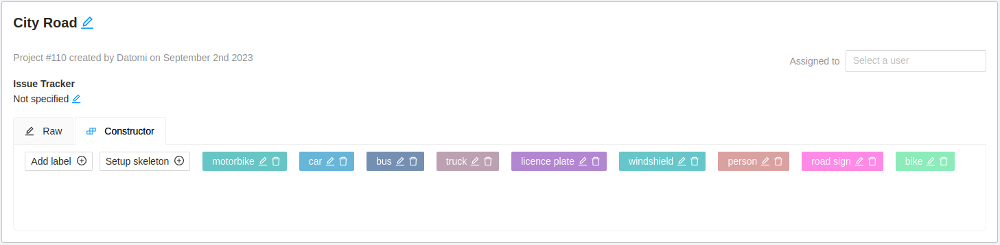
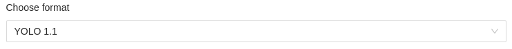
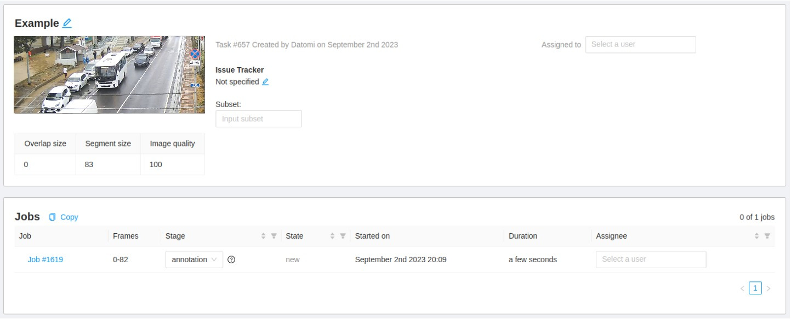
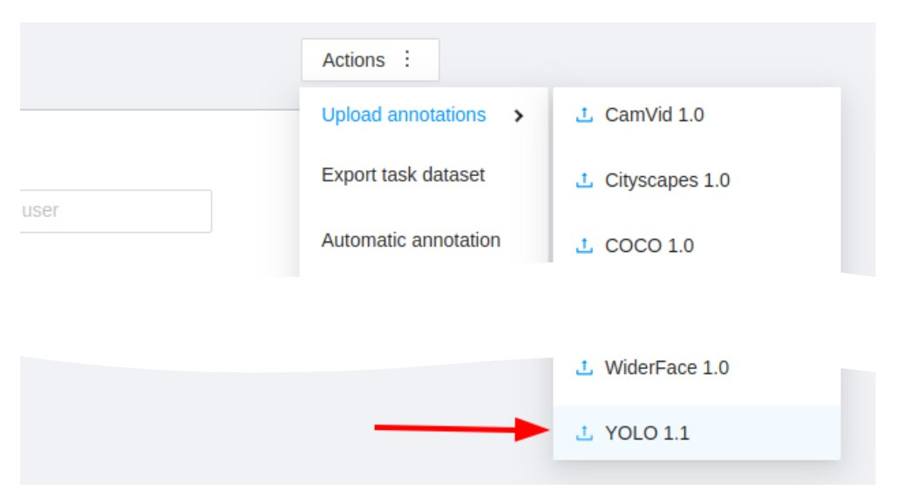
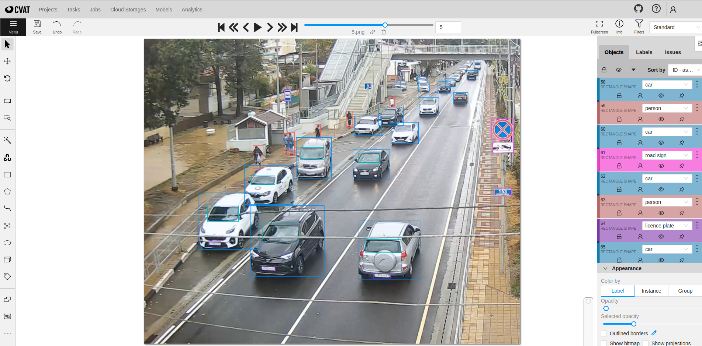

# Загрузка разметки в CVAT

[CVAT](https://github.com/opencv/cvat) - это интерактивный инструмент аннотирования видео и изображений для компьютерного зрения. 
Его используют десятки тысяч пользователей и компаний по всему миру. 
Инструмент имеет облачную и серверную версии. Инструкция по установке серверной версии доступна в официальной [документации](https://opencv.github.io/cvat/docs/administration/basics/installation/).

Для загрузки подготовленной разметки в CVAT требуется выполнить несколько шагов:
1. Создание проекта и задачи на разметку;
2. Загрузка подготовленной разметки.

При создании проекта необходимо указать все классы, которые требуется разметить:

При создании задачи на разметку важно, чтобы формат разметки был установлен в значение YOLO:

Пример созданной задачи:

Для загрузки разметки требуется выполнить следующие шаги **Actions** - **Upload annotations** - **YOLO 1.1**:

Разметка появится в выбранной задаче:

